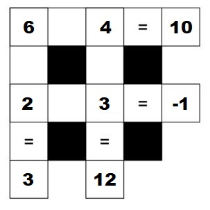

```{r, include=FALSE}
knitr::opts_chunk$set(eval=TRUE, include=TRUE, echo=TRUE, warning=FALSE, message=FALSE)
```

# Instructions

Complete the excercises in this .Rmd file and submit your .Rmd and .pdf output through [Quercus](https://q.utoronto.ca/courses/253019/assignments/782402) on September 15 by 5:00 p.m. ET. 

# Part 1: R Coding Practice

## Question 1

For this question we will work with data about the old TV show Avatar: The Last Airbender. 

- The data is stored in the file `avatar.csv` in the same directory as this file.

> This data was posted on [github](https://github.com/) by user
[averyrobbins1](https://github.com/averyrobbins1/appa) and subsequently featured on [Tidy Tuesday](https://github.com/rfordatascience/tidytuesday/blob/master/data/2020/2020-08-11/readme.md). For more information see the above links; or, install the package with `devtools::install_github("averyrobbins1/appa")` and then type `help(appa)`.

### (a) Load the data set from the file `avatar.csv` using `read_csv` (not `read.csv`) and save it as an object named "avatar". 

```{r}
# Write your answer below

```

#### Hints to help fix common "gotchas"
- `Error in read_csv(avatar.csv) : could not find function "read_csv"`
  - *Have you loaded the appropriate libraries? I.e., `library(tidyverse)`?*
- `Error in standardise_path(file) : object 'avatar.csv' not found`
  - *Do you have quotes around the file name?*
- `Error: 'avatar.csv' does not exist in current working directory (...).`
  - *Are you running code as `<ctrl-shift-end>` (PC) or `<cmd-shift-enter>` (Mac)?*

### (b) We have seen two functions that let us quickly get an idea of our data: `glimpse()` and `head()`. Using `%>%` "pipe" the `avatar` object you created into each of these functions.

```{r}
# Write your answer below

```

```{r}
# Write your answer below

```

\newpage <!-- Move and use the `\newpage` break marker as needed
              so the knitted pdf output fits sensibly on each page -->

### (c) Run the two code chunks below using <ctrl-shift-enter> (PC) or <cmd-shift-enter> (MAC) or the "play" button, and then compare their output to the output of the `glimpse()` and `head()` functions above. 

```{r, eval=FALSE}
avatar
```

```{r, eval=FALSE}
avatar %>% head(3) # <- try another number instead of 3... maybe 12?
```

- Is the `glimpse()` output or the `head()` output a `tibble`? 

*REPLACE THIS TEXT WITH YOUR ANSWER*

- Which function allows you to look at the first `n` rows of a data set?  

*REPLACE THIS TEXT WITH YOUR ANSWER*

- Which function lists data set columns vertically rather than horizontally so you can immediately see them all?

*REPLACE THIS TEXT WITH YOUR ANSWER*

- How many observations does the `avatar` data frame include? 

*REPLACE THIS TEXT WITH YOUR ANSWER*

- How many variables are measured for each observation? 

*REPLACE THIS TEXT WITH YOUR ANSWER*

- How many rows and columns does the `avatar` data frame have? 

*REPLACE THIS TEXT WITH YOUR ANSWER*

- Is the information for the three previous questions available from the `glimpse()` function or the `head()` function?

*REPLACE THIS TEXT WITH YOUR ANSWER*

## Question 2

Below is a 'math square puzzle'. The value for each row and column is shown after the equals signs, but the operations (`+`, `-`, `*`, `/`) producing the resuts are missing. For example, a row with "2 blank 7 = 14" is missing a multiplication.

{width=250px}

### (a) Write out the full correct equations below and assign them to the appropriate names. The first rows has been completed as an example.

```{r}
# Row 1 (r1)
r1 <- 6 + 4
  
# Row 2 (r2)

# Column 1 (c1)

# Column 2 (c2)

```

### (b) Now, let's check each of your answers individually with the logical `==` operation.

```{r}
r1 == 10
r2 == -1
c1 == 3
c2 == 12
```

### (c) Now, let's check each of your answers at the same time with logical `&` operations.

```{r}
(r1 == 10) & (r2 == -1) & (c1 == 3) & (c2 == 12)
```

#### Consider the code above relative to the code below using the `c()` "concatentation" function which "combines" objects into a ***vector***.  

```{r}
my_answers <- c(r1,r2,c1,c2)
square_answers <- c(10,-1,3,12)
my_answers == square_answers
```

#### Consider the code above relative to the code below using the `all()` function which checks if every element of a vector is `TRUE`. 

```{r}
correctness <- my_answers == square_answers
all(correctness)
```

### (d) What is the benefit of using the `c()` and `all()` functions compared to just writing everything out with logical `==` and `&` operators? 

*REPLACE THIS TEXT WITH YOUR ANSWER*

#### Hints
- Right now we just have `r1`, `r2`, `c1` and `c2`. But what if we had a bigger math square that went all the way up to, say, `r100` and `c100`?
- "Vectorized" computer operations do a series of individual observations in parallel, rather than sequentially. So just like writing out things sequentially takes a long time, doing operations sequentially with a computer also takes more time than just computing them in parallel.

### (e) What is the difference between the code below and the `all(correctness)` code above?

```{r}
sum(correctness)
```

*REPLACE THIS TEXT WITH YOUR ANSWER*


# Part 2: TUT communication/writing exercises *Primer Questions*

You are expected to be efficient with your time in this section, 
and should ***spend no more than 30 minutes*** **on Part 2**.

## Question 1

### (a) How is it that you have come to take STA130?

*REPLACE THIS TEXT WITH YOUR ANSWER*

### (b) Do you currently have a sense of the kind of career (e.g., industry, company, type of work) you think you might want to pursue?  Please describe your current thinking on this aspect of your university experience.

*REPLACE THIS TEXT WITH YOUR ANSWER*

## Question 2

Suppose you ask your friends to name 10 songs produced prior to Dec 31, 1999 and 10 songs produced after Jan 1, 2000. Then, suppose you check the song statistics on Spotify.

### (a) If the total number of times the older songs have been listened to is greater than the newer songs, would this confirm that music from earlier periods is better than music now?

*REPLACE THIS TEXT WITH YOUR ANSWER*

### (b) If the average number of times (per user and per year) the older songs have been listened to is greater than the newer songs, would this confirm that music from earlier periods is better than music now?

*REPLACE THIS TEXT WITH YOUR ANSWER*

### (c) Could there be a systematic reason that the 10 songs produced prior to Dec 31, 1999 that your friend selected might be expected to have a higher number of listens?

#### Hints
- Are the 10 songs produced prior to Dec 31, 1999 that your friend selected fairly representative of all songs produced prior to Dec 31, 1999?
- This question is addressing ***survivorship bias***, which will be considered further in your upcoming tutorial class.

# Additional Recommended Study Material

Did you finish quickly?  Do you still have an unused course study time allocation? Would you like to cover this material a little bit more?  

## More Introductory R Material

The following materials all approach learning R slightly differently, but they each have quite good perspective.

- [R for Data Science Chapter 4: Workflow basics](https://r4ds.had.co.nz/workflow-basics.html)
- [Rstudio Primer: Programming Basics](https://rstudio.cloud/learn/primers/1.2)
- [The Department of Statistical Science Toolkit](https://dosstoolkit.com/)

## Markdown

Markdown supports efficiency and productivity, and it's needed for our class.

- [Markdown Tutorial](https://www.markdowntutorial.com/)
- [RStudio Markdown](https://rmarkdown.rstudio.com/)
- [RStudio Markdown Cheatsheet](https://www.rstudio.com/wp-content/uploads/2015/02/rmarkdown-cheatsheet.pdf)
